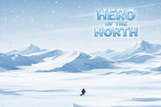

# Hero of the North

Action-adventure game project featuring level-based progression and player combat mechanics.

 

## About the Game

Dahak is a huge, terrifying sea lion who has taken over the penguin kingdom and captured your people. You are the last penguin left, the Hero of the North. Your mission is to survive dangerous levels, avoid traps, and rescue as many penguins as possible while Dahak tries to stop you.

## Inspiration

Hero of the North was inspired by Level Devil and its troll-platformer style where the game constantly tries to trick the player. This project builds on that idea but adds a story-driven objective so each level feels meaningful.

## What the Game Does

This is a story-based platformer made for Reddit. Players move through snowy environments and avoid hidden traps, some appearing when it is already too late while others require careful thinking.

The game is designed around daily levels. A new level unlocks each day so players always have something fresh to play.

A scoring system called Trust Points tracks performance based on:

- How fast you finish each level
- How few replays were needed to complete the level
- How many penguins you rescued

Higher Trust Points improve your position on the Hero Rankings leaderboard.

## Features

- Story-based platforming progression
- Hidden and reactive trap design
- Daily level unlock system
- Trust Points scoring and leaderboard competition

## Technical Overview

- **Primary Stack:** C#, ShaderLab, HLSL, TypeScript, HTML, CSS, JavaScript
- **Engine/Platform:** Unity and Reddit-integrated game delivery
- **Focus Areas:** Platformer controls, trap sequencing, level pacing, and progression scoring

## Screenshots

Only a banner image is available right now. Additional screenshots will be added later.

## Tech Used

C#, ShaderLab, HLSL, TypeScript, HTML, CSS, JavaScript

## Development Date

February 2026

