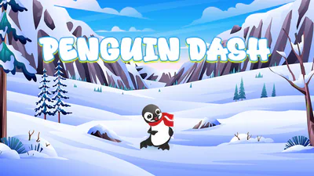
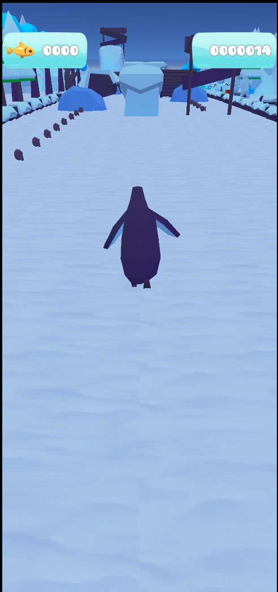
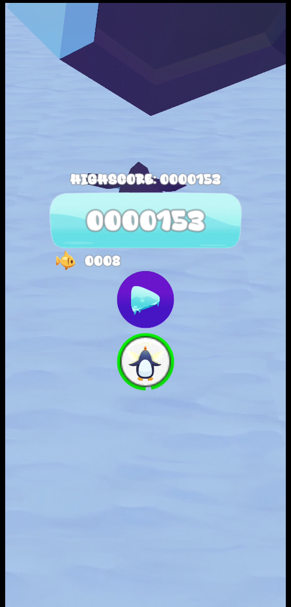
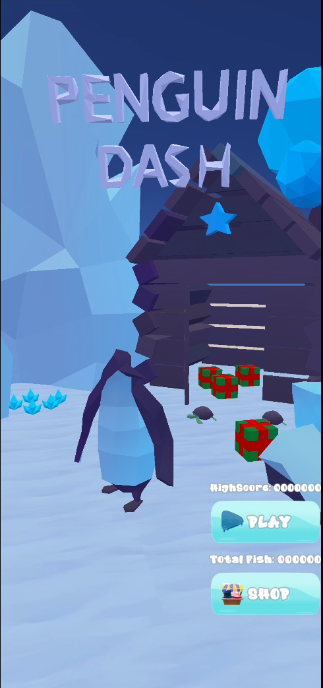
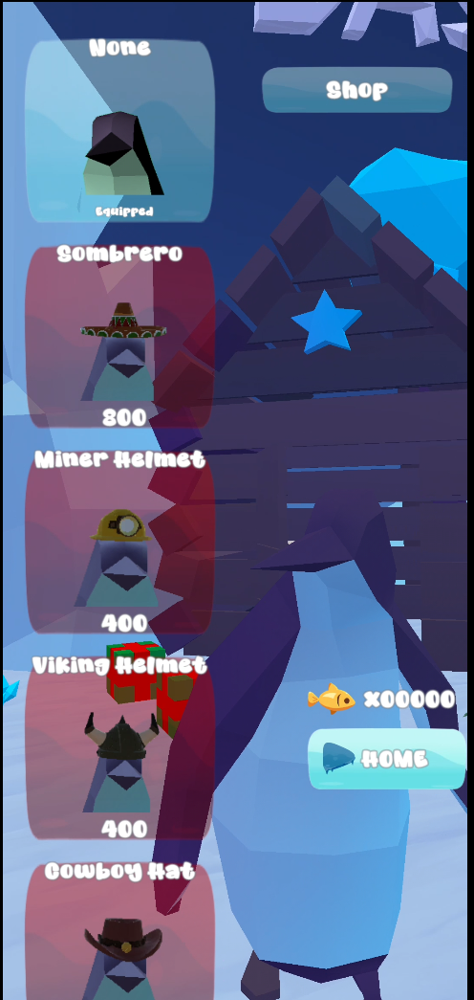
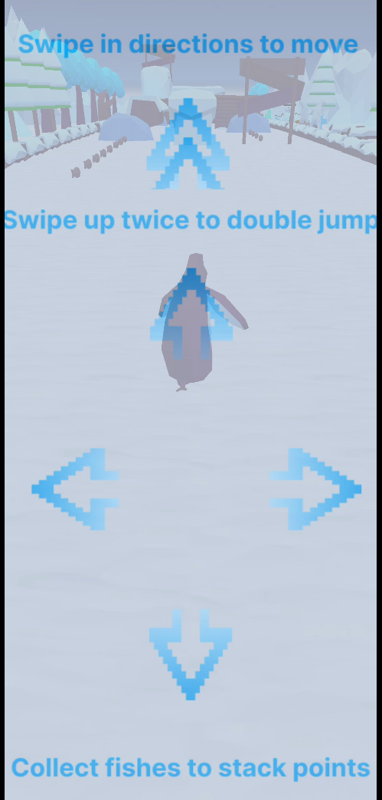

# Penguin Dash

3D runner game where players dodge obstacles, collect momentum, and survive as long as possible.

## About the Game

Penguin Dash is a 3D Endless Runner project in my game development portfolio. The gameplay design emphasizes a simple core loop, responsive controls, and replay value.

## Features

- Shop System
- Unity Legacy Ads

## Technical Implementation

### Implementations and Programming

- Unity New Input System
- Cinemachine
- Shader Graphs

### Programming

- Object Pooling (for optimization)
- State Machines
- Singletons
- Observer System
- Serialized Saving

## Technical Overview

- **Primary Stack:** C#, ShaderLab, HLSL
- **Engine/Platform:** Unity (for Unity-based entries) and platform-specific tooling where applicable
- **Focus Areas:** Gameplay mechanics, scene setup, player interaction, balancing, and iteration

## Screenshots

Portrait screenshots displayed in a horizontal scroll layout.

	
	
	
	
	

## Tech Used

C#, ShaderLab, HLSL

## Development Date

December 2024

## Tags

#arcade #other
