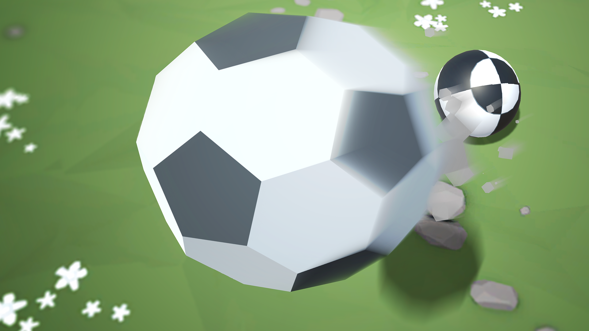

# Challenge Soccer Ball

Soccer-inspired challenge game focused on precision control, timing, and obstacle navigation.

 

## About the Game

Challenge Soccer Ball was completed as a learning challenge to apply Sumo Battle prototype mechanics in a different context: a competitive soccer field.

## Challenge Overview

Use the skills learned in the Sumo Battle prototype in a completely different context. You control a ball by rotating the camera around it and applying forward force, but instead of knocking enemies off an edge, the goal is to knock them into the opposing net while they try to score in your net. After each round, a new wave spawns with more enemy balls to increase difficulty.

Almost nothing in the original project was functioning, and the challenge was to make the full gameplay loop work correctly.

## Challenge Outcome

- Enemies move toward your net, and can be deflected by hitting them
- Powerups apply a temporary strength boost, then disappear after 5 seconds
- When there are no more enemy balls, a new wave spawns with 1 more enemy

## Features

- Wave-based enemy pressure system
- Temporary powerup strength boosts
- Ball control driven by camera-relative movement

## Technical Overview

- **Primary Stack:** C#
- **Engine/Platform:** Unity (for Unity-based entries) and platform-specific tooling where applicable
- **Focus Areas:** Physics interactions, player control feel, enemy behavior, wave scaling, and powerup lifecycle

## Screenshots

Portrait screenshots displayed in a horizontal scroll layout.

	
	

## Tech Used

C#

## Development Date

November 2024

