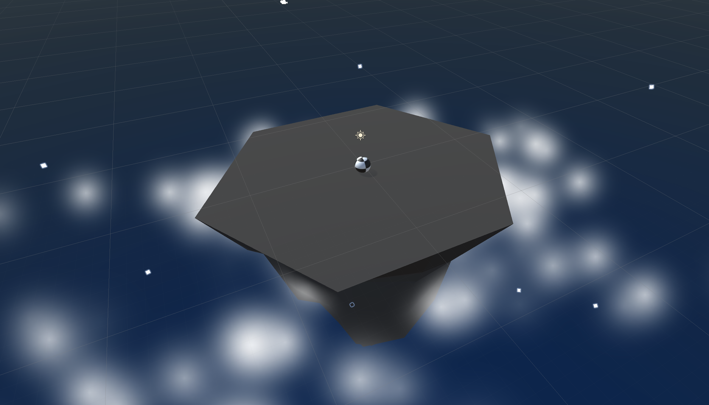
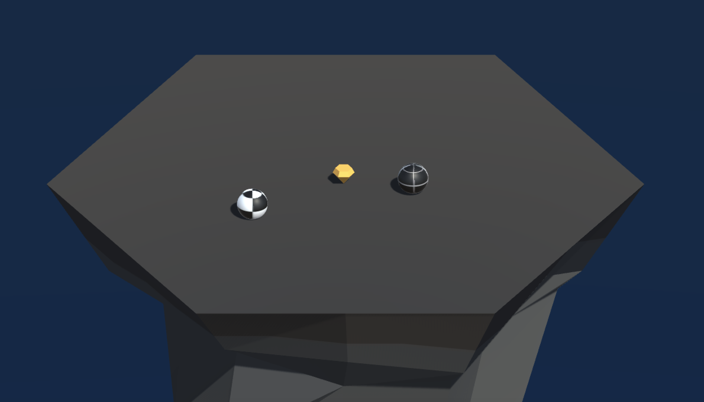
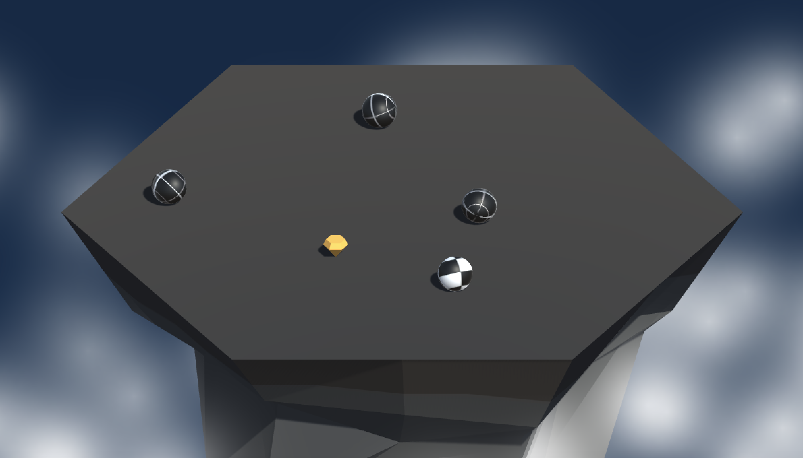

# Sumo Ball

Ball sumo wrestling on a floating island with physics-based push-and-survive gameplay.

## About the Game

Sumo Ball is a Physics Arena project in my game development portfolio. The gameplay design emphasizes a simple core loop, responsive controls, and replay value.

## Features

- Physics-based ball-to-ball collisions
- Push-out arena objective on a floating island
- Wave-driven gameplay pressure

## Technical Implementation

### Core Systems

- Camera-relative movement control
- Force-based player and enemy interactions
- Round and wave progression handling

### Programming Patterns

- Reusable gameplay scripting in C#
- Collision-driven game state events
- Parameter tuning for movement and knockback feel

## Technical Overview

- **Primary Stack:** C#
- **Engine/Platform:** Unity (for Unity-based entries) and platform-specific tooling where applicable
- **Focus Areas:** Physics gameplay, control responsiveness, collision balancing, and iterative tuning

## Screenshots

Portrait screenshots displayed in a horizontal scroll layout.

	
	

## Tech Used

C#

## Development Date

November 2024
