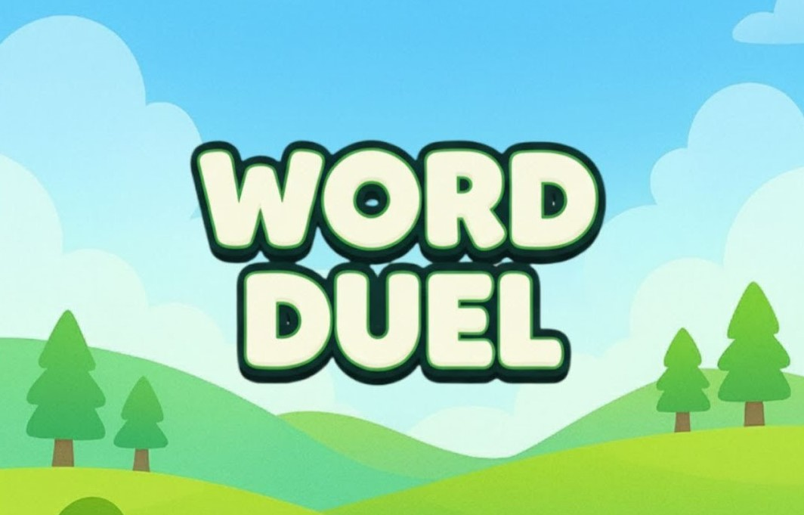
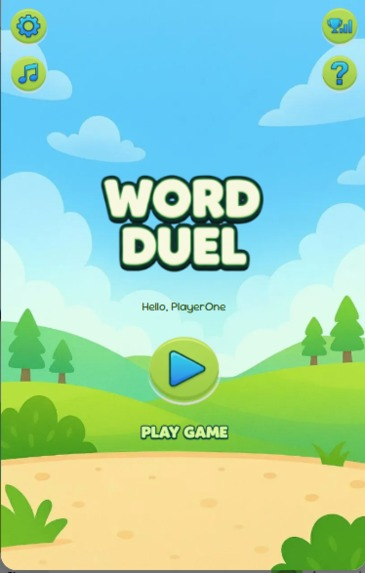
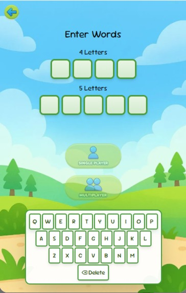
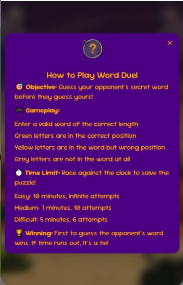
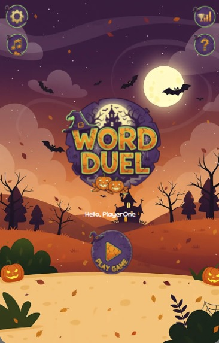
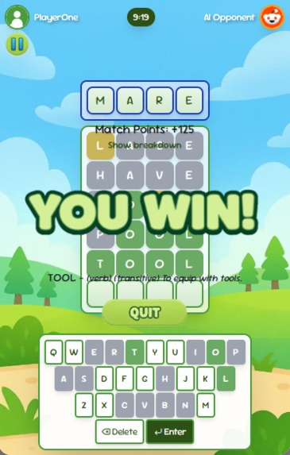

# Word Duel

A multiplayer word guessing game built on Devvit with head-to-head rounds and score tracking.

 

## About the Game

Word Duel is a turn-based, 1v1 word-guessing game with two playable modes:

- **Player-vs-Player:** A user sets their own secret word and gets paired with another Reddit user who has done the same. Players take turns guessing each other's word.
- **Player-vs-AI:** A user sets their secret word and plays against a computer opponent.

The AI supports three difficulty levels: **Easy**, **Medium**, and **Difficult**, ranging from a simple guesser to a full deductive-logic bot.

The experience includes themed UIs, a custom on-screen keyboard, and word validation via a local dictionary API.

All visual assets in Word Duel were created specifically for this project. Audio assets were sourced from Pixabay under a Creative Commons license, allowing free use.

## Features

- Turn-based 1v1 gameplay
- PvP matchmaking flow with user-defined secret words
- PvAI mode with scalable bot difficulty
- Themed UI system and custom keyboard
- Local dictionary-driven word validation

## Technical Implementation

### Core Systems

- Devvit-based game flow and interaction handling
- Guess evaluation and turn-state control
- AI logic for progressive difficulty behavior

### Programming Focus

- TypeScript-driven gameplay architecture
- Modular UI and state handling
- Logic-first bot decision strategies

## Technical Overview

- **Primary Stack:** TypeScript, JavaScript, HTML, CSS
- **Engine/Platform:** Devvit and web UI technologies
- **Focus Areas:** Turn logic, multiplayer flow, AI deduction behavior, and UX clarity

## Screenshots

Portrait screenshots displayed in a horizontal scroll layout.

	
	
	
	
	
	

## Tech Used

TypeScript, JavaScript, HTML, CSS

## Development Date

October 2025

